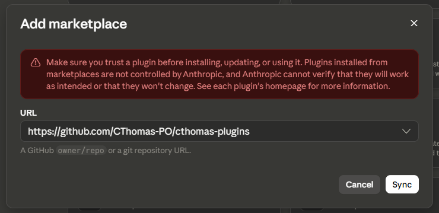
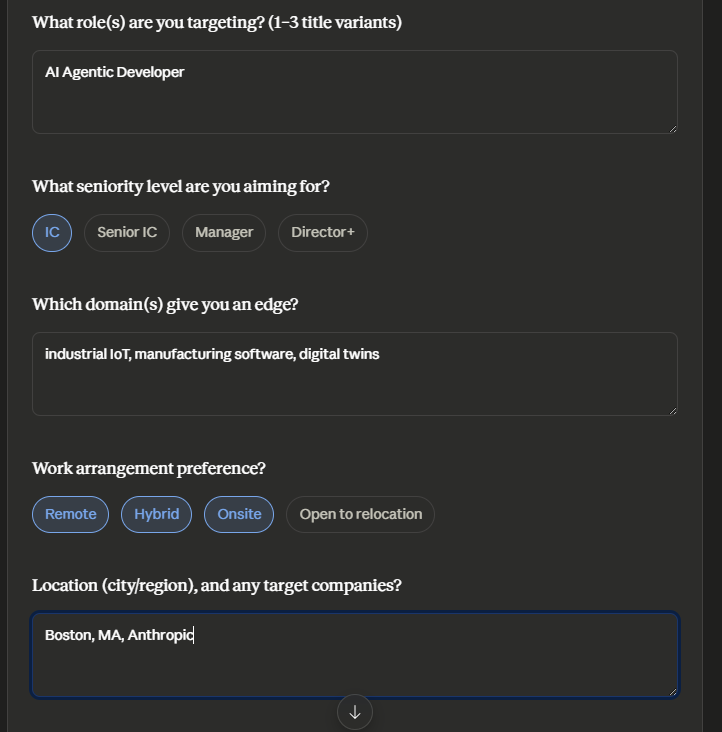
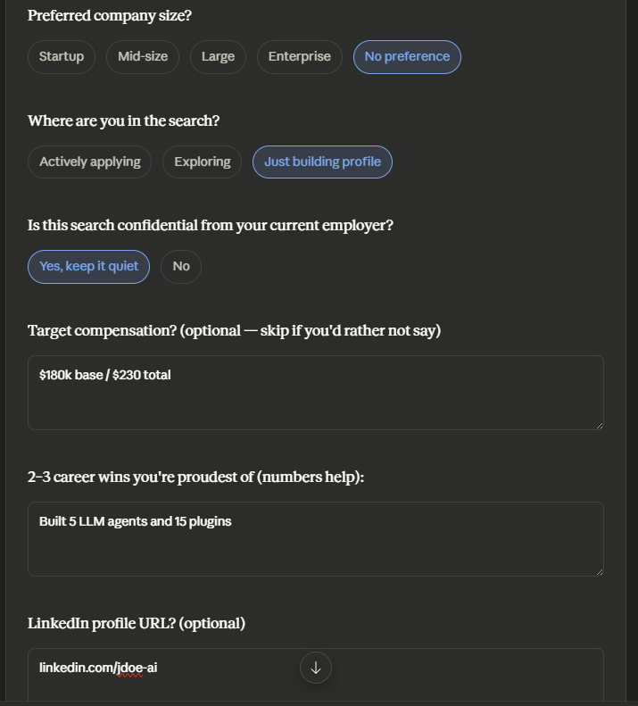
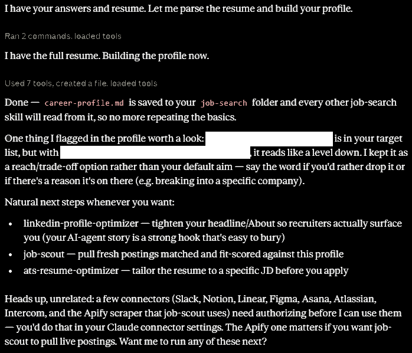
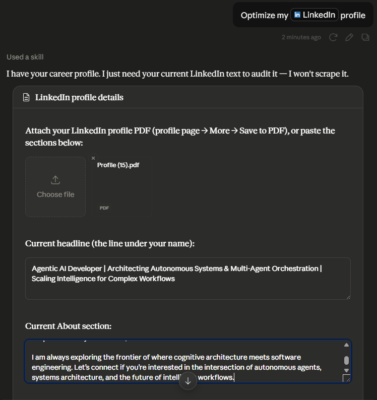
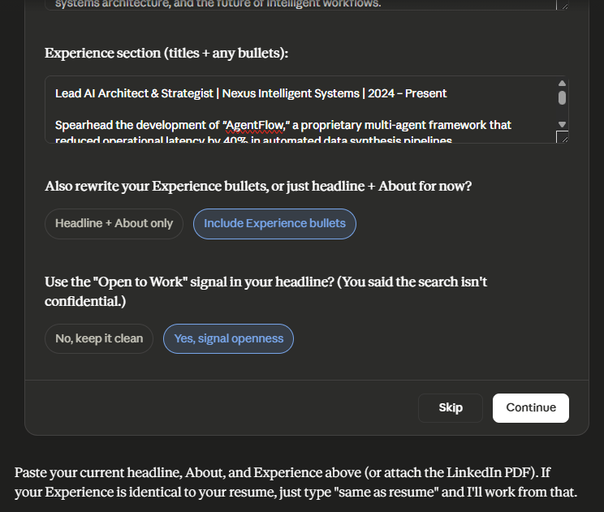
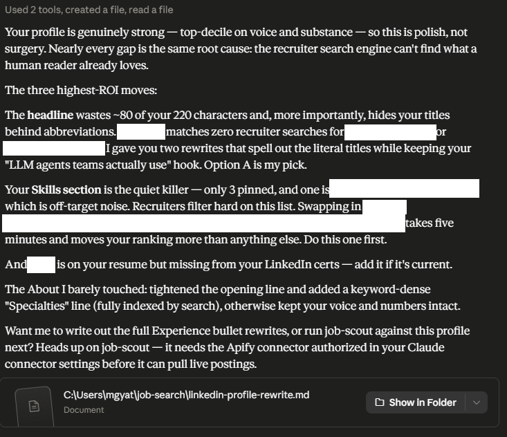

# Getting Started with Job Search Copilot

A job-search assistant that runs inside Claude's Cowork mode. Six skills that share one career profile — you explain yourself once, and every skill builds on it: optimize your LinkedIn profile, find and rank fresh job postings, tailor your resume for ATS systems, map warm paths into target companies, and run a 4-week content plan.

**Requirements:** the [Claude desktop app](https://claude.ai/download) with Cowork mode.

---

## 1. Install the plugin

1. Open the Claude desktop app and click **Customize** in the sidebar, then **Plugins**.
2. Click the **+** button and choose **Add from a repository**.
3. Paste this repository's URL: `https://github.com/CThomas-PO/cthomas-plugins`

4. **job-search-copilot** appears in the plugin list — click to install.

That's it. Open a Cowork session and the skills are available.

---

## 2. First run: set up your career profile

Everything starts here. In a Cowork session, say:

> Set up my career profile

Claude will ask you to **connect a working folder** (pick or create a folder like `Documents\job-search`) — your profile, resume rewrites, and job lists are saved there so they persist between sessions.

Then it gathers, conversationally: your resume (attach it), target role(s), domain, seniority, location and remote preferences, company size, compensation target, timeline — and whether your search is **confidential**. Answer that last one honestly; other skills change their behavior to avoid tipping off your current employer.

The result is a `career-profile.md` file in your folder. Every other skill reads it, so you never repeat yourself.

---

## 3. The skills

### Optimize your LinkedIn profile

> Optimize my LinkedIn profile

Paste your headline/About/Experience or attach your profile PDF (LinkedIn: your profile → **More** → **Save to PDF**). You get a gap analysis — missing keywords, weak identity framing, buried credentials — then recruiter-search-optimized rewrites of your headline and About, with the reasoning explained.

### Find and rank jobs

> Find [your role] jobs posted in the last week

The first run asks you to connect **Apify** — the scraping service that fetches LinkedIn postings. It's a one-time, ~2-minute setup with no credit card: see [Setting up Apify](#setting-up-apify-one-time-2-minutes) below. After that, Claude tells you the estimated cost before every run; typical searches cost pennies and are covered by Apify's free monthly credit.

You get a ranked table — company, role, location, salary, posting date, and a 1–10 fit score against your resume — plus a **Top 10: apply now** list, saved as a spreadsheet.

No Apify? The skill offers free official connectors (Indeed, ZipRecruiter, Dice) or you can paste postings manually.

### Tailor your resume to a job description

> Tailor my resume to this JD: [paste or link]

Claude parses the JD like an ATS (extracting every keyword and requirement), scores your current resume's match rate, rewrites your bullets to mirror the JD's language **without inventing anything**, then re-scores and flags any phrasing a human would read as keyword stuffing. Output is a polished .docx.

### Find warm paths into a company

> Who do I know at [company]?

The first run walks you through exporting your LinkedIn connections (LinkedIn → **Settings & Privacy** → **Data privacy** → **Get a copy of your data** → check **Connections** — takes about 10 minutes to arrive by email). Drop the CSV in your working folder.

For any target company you get: your 1st-degree contacts there, likely warm-intro paths (honestly labeled as inferences — the export can't truly see 2nd-degree connections), and a ready-to-send message drafted per contact based on your real shared history.

### Build your content plan

> Build my LinkedIn content plan

Generates 10 post ideas across four pillars — builder credibility, lessons from your current role, domain POVs, and job-search behind-the-scenes (auto-swapped for a discreet alternative if your search is confidential). Each idea is a written-out hook + angle + format, sequenced over 4 weeks so your first week or two build authority *before* your outreach lands. Delivered as a content calendar spreadsheet.

---

## 4. Suggested flow

1. **career-profile-setup** — once
2. **linkedin-profile-optimizer** — fix your profile before recruiters look at it
3. **job-scout** — weekly (ask Claude to schedule it)
4. **ats-resume-optimizer** — per application, for your top-fit postings
5. **network-mapper** — per target company, before you apply cold
6. **content-engine** — running in the background the whole time

---

## Setting up Apify (one time, ~2 minutes)

Apify is the service the job-scout skill uses to fetch LinkedIn job postings. Don't let the word "API" scare you off — there are no keys to copy and nothing to configure. You create a free account and click one authorization button. That's the whole thing.

### Step 1 — Create a free Apify account

1. Go to [apify.com](https://apify.com) and click **Sign up**.
2. Sign up with Google, GitHub, or your email. **No credit card is required** — not now, not later, unless you choose to upgrade.
3. That's it. The free plan includes **$5 of usage credit every month**, which covers thousands of job results — far more than a typical job search needs.

> If Apify shows you an onboarding tour or asks what you want to build, you can skip all of it. You never need to touch the Apify website again after signing up.

### Step 2 — Connect Apify to Claude

1. Back in Claude, ask job-scout to find jobs (or open **Customize → Connectors** and find **apify** under the plugin's connectors).
2. Claude tells you Apify needs to be connected and opens a browser window to Apify's authorization page.
3. Log in if asked, then click **Authorize** / **Allow**.

You'll land back in Claude, connected. You won't be asked again on this computer.

### Step 3 — Verify it works

Ask Claude:

> Find product manager jobs posted in the last 7 days in Chicago

Claude should confirm the search parameters and estimated cost (typically **under 15 cents** for 100 results), then run the search. If you see a ranked table of jobs — you're done.

### Apify FAQ

**Will this cost me money?** Not unless you want it to. The free $5 monthly credit resets every month. If you somehow use it up, Apify simply stops running searches until next month — it cannot charge you, because there's no card on file.

**Why do I need Apify at all?** LinkedIn doesn't offer a public way to search its job postings from outside tools. Apify runs "actors" — small scraping programs — that collect public job postings on your behalf.

**Is my LinkedIn account involved?** No. You never give the plugin or Apify your LinkedIn login. The scraping happens entirely on Apify's side, against publicly visible postings.

**I got an error about credits or limits.** Check [console.apify.com](https://console.apify.com) → Billing to see your remaining monthly credit. If it's exhausted, wait for the monthly reset, or ask job-scout to use the free Indeed/ZipRecruiter/Dice connectors instead.

**I'd rather not use Apify.** Fine! Job-scout works without it — it will offer official job-board connectors (Indeed, ZipRecruiter, Dice; free, no LinkedIn coverage) or you can paste job postings in manually.

---

## Troubleshooting & FAQ

**The skills don't trigger.** Make sure you're in a Cowork session (not regular chat) and the plugin shows as installed under Customize → Plugins.

**"I can't find your career profile."** Connect the same working folder you used during setup — the profile lives in `career-profile.md` there.

**Is scraping LinkedIn okay?** Third-party scrapers access public postings but operate against LinkedIn's terms of service. The plugin never asks for your LinkedIn login, so your account isn't involved — but use your judgment, or stick to the official Indeed/ZipRecruiter/Dice connectors.

**What does it cost?** The plugin is free. Job scraping via Apify costs roughly $0.40–$1.50 per 1,000 results (a free-tier account covers casual use). Everything else uses your existing Claude subscription.

**Privacy note.** Your resume, profile, and connections CSV stay in your working folder on your machine. Nothing is uploaded anywhere except what you explicitly send to scraping services (job search terms — never your personal data).

**How do I get the latest version?** Check the version listed in the [changelog](../README.md#changelog) against yours (Customize → Plugins → job-search-copilot). Marketplace re-sync in the desktop app is currently unreliable for personal marketplaces — the app compares against a cached copy of the marketplace, so "you have the latest version" can be wrong. The dependable route: (1) remove the **plugin**, (2) remove the **marketplace itself** (menu on the marketplace entry — this is the step that clears the stale cache), (3) quit and relaunch Claude, (4) re-add the marketplace (Customize → Plugins → + → Add from a repository) and reinstall. Your career profile and saved files are untouched — they live in your working folder, not in the plugin.
